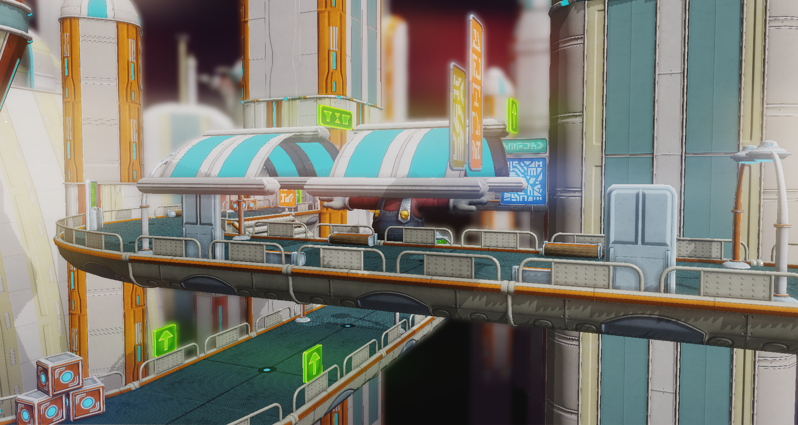

# Project 7: Deferred Renderer

* University of Pennsylvania
* pennkey : byumjin
* name : [Byumjin Kim](https://github.com/byumjin)

## Live Demo

| Mario in the Sky city! |
| --- |
|  |

* [WebGL Link](https://byumjin.github.io/MarioInTheSkyCity/)

- Volume up!

### GUI

- DOF
    - Focal_Distance : control the focal point focused by main camera.
    - DOF_Iteration : The number of iteration of DOF's blur 
- Bloom
    - Bloom_Iteration : The number of iteration of Bloom effect's blur 
- Lens Flare
    - Lens_Intensity : Intensity of Lens flare effect
    - Lens_Ghost : The number of ghost effects
    - Lens_Dispersal : The degree of stracted ghost effects
    - Lens_Distortion : The intensity of choromatic effects
- Tone Mapping
    - ToneClass : choose one of pre-defined tone mapping effect
    - Temperature : control the color temperature
- HBAO
    - HBAO_Intensity : Intensity of HBAO
    - HBAO_Bias : cap the minimum angle for calculating AO
    - HBAO_Max_Length : cap the maximum length of AO comparison between neighbor pixels
    - HBAO_StepSize : Step size for comparison between neighbor pixels
Artistic_Effect
    - Pointillism
    - Oil Painting

## Graphics PipeLines

| Graphics Pipelines |
| --- |
|  |

### Standard Shadow Mapping

I used standard shadow mapping (as known as depthmap shadow).
Due to the size of my scene, it needed to use a huge resolution of the shadow map (like 4096 x 4096), for the performance of the other post-process effects, I could not do it.
The resolution of the shadow map is now 2048 x 2048.

### HBAO (Horizontal-Based Ambient Occulusion)

| HBAO Off |
| --- |
|  |

| HBAO On |
| --- |
|  |

### Depth of Field

| Iteration : 4 |
| --- |
|  |

| Iteration : 16 |
| --- |
|  |

| Focal Distance : 35 |
| --- |
|  |

| Focal Distance : 325 |
| --- |
|  |

### Bloom

| Bloom Off |
| --- |
|  |

| Bloom On |
| --- |
|  |

### Lens Flare

| Lens Flare Off |
| --- |
|  |

| Lens Flare On |
| --- |
|  |

### Tone Mapping

| None | Linear | ReinHard |
| --- | --- | --- |
|  |  |  |

| Lunar-based ReinHard | White Preserving ReinHard | RomBinDa House |
| --- | --- | --- |
|  |  |  |

| Filmic 3030K | Filmic 7000K | Filmic 10000K |
| --- | --- | --- |
|  |  |  |

### Artistic Effect

| None | 
| --- |
|  |

| Pointillism | 
| --- |
|  |

| Oil Painting | 
| --- |
|  |

## Music
 - Dire, Dire Docks - Super Mario 64

## References
