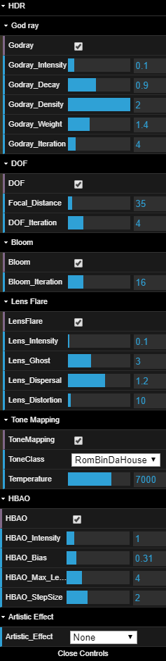

# Project 7: Deferred Renderer

* University of Pennsylvania
* pennkey : byumjin
* name : [Byumjin Kim](https://github.com/byumjin)

## Live Demo

| Mario in the Sky city! |
| --- |
|  |

* [WebGL Link](https://byumjin.github.io/MarioInTheSkyCity/)

- Volume up!

### GUI

- DOF
    - Focal_Distance : control the focal point focused by main camera.
    - DOF_Iteration : The number of iteration of DOF's blur 
- Bloom
    - Bloom_Iteration : The number of iteration of Bloom effect's blur 
- Lens Flare
    - Lens_Intensity : Intensity of Lens flare effect
    - Lens_Ghost : The number of ghost effects
    - Lens_Dispersal : The degree of stracted ghost effects
    - Lens_Distortion : The intensity of choromatic effects
- Tone Mapping
    - ToneClass : choose one of pre-defined tone mapping effect
    - Temperature : control the color temperature
- HBAO
    - HBAO_Intensity : Intensity of HBAO
    - HBAO_Bias : cap the minimum angle for calculating AO
    - HBAO_Max_Length : cap the maximum length of AO comparison between neighbor pixels
    - HBAO_StepSize : Step size for comparison between neighbor pixels
Artistic_Effect
    - Pointillism
    - Oil Painting

## Graphics PipeLines

| Graphics Pipelines |
| --- |
|  |

### Standard Shadow Mapping

I've used standard shadow mapping (as known as depthmap shadow).
Due to the size of my scene, it needed to use a huge resolution of the shadow map (like 4096 x 4096), for the performance of the other post-process effects, I could not do it.
The resolution of the shadow map is now 2048 x 2048.
P.S this low resolution makes looking better when the oil painting option is turned on.

### Lighting model

I've used GGX BRDF lighting model as usual. Every object has 3 textures, albedo(albedo's rgb and emissive intensity), specular(specular's rgb and roughness), normal(normal's and depth), and passed by each G-buffers.
I've tried to use depth buffer as depth map but i didn't work. :(

| GGX |
| --- |
|  |

### HBAO (Horizon-Based Ambient Occulusion)

Ambient occlusion is a shading and rendering technique used to calculate how exposed each point in a scene is to ambient lighting. For example, the interior of a tube is typically more occluded (and hence darker) than the exposed outer surfaces, and the deeper you go inside the tube, the more occluded (and darker) the lighting becomes. At the 2008 SIGGRAPH tech conference NVIDIA introduced an upgraded SSAO variant called Horizon Based Ambient Occlusion (HBAO).

Unlike previous SSAO variants, HBAO uses a physically-based algorithm that approximates an integral with depth buffer sampling. In other words, the upgrade enables HBAO to generate higher-quality SSAO whilst increasing the definition, quality, and visibility of the AO shadowing.

[more detail](http://guitarjawa.net/?page_id=789)

| HBAO Off |
| --- |
|  |

| HBAO On |
| --- |
|  |

### Depth of Field

In optics, particularly as it relates to film and photography, depth of field (DOF), also called focus range or effective focus range, is the distance between the nearest and farthest objects in a scene that appear acceptably sharp in an image. Although a lens can precisely focus at only one distance at a time, the decrease in sharpness is gradual on each side of the focused distance, so that within the DOF, the unsharpness is imperceptible under normal viewing conditions. I referred to [AMD’s advanced DOF](https://developer.amd.com/wordpress/media/2012/10/Scheuermann_DepthOfField.pdf) which needs pre-blurred scene texture with DOF factor.

| Iteration : 4 |
| --- |
|  |

| Iteration : 16 |
| --- |
|  |

| Focal Distance : 35 |
| --- |
|  |

| Focal Distance : 325 |
| --- |
|  |

### Bloom

Light Bloom (sometimes referred to as light bloom or glow) is a computer graphics effect used in video games, demos, and high dynamic range rendering to reproduce an imaging artifact of real-world cameras. For this, I have used down-sampled( divide by 8 ) scene texture which has scene image before post-process phases for performance optimization and to get a better quality result.
To blur image, Gaussian blurring method is used at two passes with mipmaps. (The first pass is for Horizontal Blurring and, the second pass is for Vertical Blurring)

And, like [alien isolation's bloom effect](https://github.com/CIS-566-2018/homework-7-deferred-renderer-byumjin/tree/master/imgs/alien_isolation.jpg), I gave longer steps to strectch blurring effect, horizontally.

| Bloom Off |
| --- |
|  |

| Bloom On |
| --- |
|  |

### Lens Flare

Lens flare refers to a phenomenon wherein light is scattered or flared in a lens system, often in response to a bright light, producing an undesirable effect on the image.
In order to create this effect, I referred to [John chapman’s Lens flare](http://john-chapman-graphics.blogspot.com/2013/02/pseudo-lens-flare.html) which is not physically-based model. 

| Lens Flare Off |
| --- |
|  |

| Lens Flare On |
| --- |
|  |

### Tone Mapping

I've referred to Tone Mapping method from [Shader toy](https://www.shadertoy.com/view/lslGzl).
And, depending on the color temperature, its atmosphere is changed.

| None | Linear | ReinHard |
| --- | --- | --- |
|  |  |  |

| Lunar-based ReinHard | White Preserving ReinHard | RomBinDa House |
| --- | --- | --- |
|  |  |  |

| Filmic 3030K | Filmic 7000K | Filmic 10000K |
| --- | --- | --- |
|  |  |  |

### Artistic Effect

| None | 
| --- |
|  |

| Pointillism | 
| --- |
|  |

I've used instance draw as previous homework. First, generate bunch of tiny quads which take one certain part of screen space.
In other words, each quad can fetch one color from scene image texture. Then, just draw them with using instance draw on new framebuffer.
It is literally same thing what real painters are doing!

| Oil Painting | 
| --- |
|  |

I've referred to [Kuwahara filter](https://en.wikipedia.org/wiki/Kuwahara_filter)

## References

- [HBAO](http://www.nvidia.com/object/siggraph-2008-HBAO.html)
- [AMD’s advanced DOF](https://developer.amd.com/wordpress/media/2012/10/Scheuermann_DepthOfField.pdf)
- [John chapman’s Lens flare](http://john-chapman-graphics.blogspot.com/2013/02/pseudo-lens-flare.html)
- [Tone Mapping](https://www.shadertoy.com/view/lslGzl)
- [Kuwahara filter](https://en.wikipedia.org/wiki/Kuwahara_filter)

## Music

 - Dire, Dire Docks - Super Mario 64
